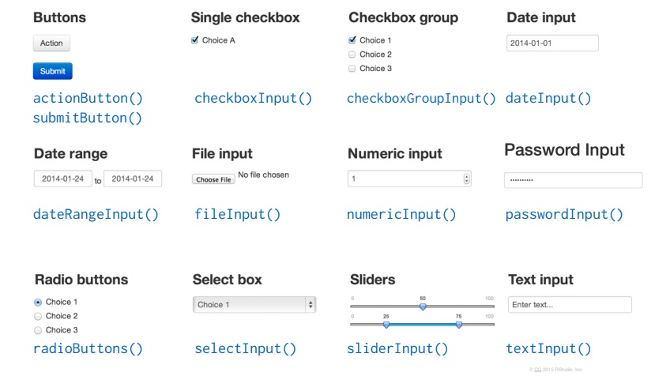

# 1. INTRODUÇÃO

## 1.1. O que é o Shiny?
 
 * O código de uma aplicação Shiny nos permite estruturar tanto a interface com o usuário quanto o processamento de dados, geração de visualizações e modelagem, isto é, nós programamos tanto o **user side** quanto o **server side** numa tacada só. Assim, ao rodarmos o código, criamos um servidor que envia páginas web, recebe informações do usuário e processa os dados, utilizando apenas o R.

* O Shiny é utilizado para criação de aplicações interativas na web que podem ser utilizadas na apresentação de dados de maneira **interativa** com inovadores recursos de visualização. Além disso, oferece uma interessante interface gráfica para disponibilizar aplicações para as pessoas que não têm familiaridade com R.


# 2. ESTRUTURA

Um aplicativo em Shiny (ou Shiny app) é gerado por um único script chamado `app.R`. Esse script tem três componentes:

* Um objeto com a interface do usuário (user side);
* Uma função server() (server side);
* Uma chamada para a função shinyApp().

### O código, então, se compôe da seguinte forma:

```{r estrut, eval=FALSE, include=TRUE}
library(shiny)

ui <- fluidPage()

server <- function(input, output) {}

shinyApp(ui = ui, server = server)
```

## 2.1. USER INTERFACE
Tudo o que será apresentado ao usuário está guardado no objeto `ui`, que, no final, se analisarmos é um código HTML.
Na tabela abaixo estão listadas as funções utilizadas relacionadas a estrutura da página na UI e suas respectivas finalidades: 

Função | Finalidade
------------- | -------------
library(shiny) | Carregar o pacote Shiny.
shinyUI(fluidPage) | Criar uma interface com o usuário.
titlePanel() | Criar um painel contendo um título do aplicativo.
sidebarLayout() | Criar um layout com uma barra lateral e área principal. A barra lateral é exibida com uma cor de fundo distinta e geralmente contém controles de entrada. A área principal ocupa 2/3 da largura horizontal e geralmente contém saídas.
sidebarPanel() | Criar um painel com barra lateral, que contenha controles de entrada que, por sua vez, possam ser passados para SidebarLayout.
mainPanel() | Criar um painel principal contendo elementos de saída que, por sua vez, pode ser passado para sidebarLayout

Com as funções acima são criados apenas títulos e painéis. Não há nada com o que o usuário possa interagir. Para isso, precisamos adicionar os `inputs`. A função vai depender do tipo de interação que você quer que o usário tenha. A seguir temos uma tabela com as funções que podem ser utilizadas e suas respectivas finalidades.


### 2.1.1. FUNÇÕES INPUT

Função | Finalidade
------------- | -------------
ActionButton |  Criar um botão de ação, cujo valor é inicialmente zero e aumenta em um cada vez que é pressionado.
actionLink | Criar um link de ação cujo valor é, inicialmente, zero e aumenta em um cada vez que é pressionado.
checkboxGroupInput | Criar um grupo de caixas de seleção que podem ser usadas para alternar várias opções de modo independente.
checkboxInput | Criar uma caixa de seleção que pode ser usada para especificar valores lógicos.
dateInput | Criar uma entrada de texto que, quando clicada, traz um calendário no qual o usuário pode clicar para selecionar datas.
dateRangeInput | Criar um par de entradas de texto que, quando clicadas, trazem calendários nos quais o usuário pode clicar para selecionar datas.
fileInput | Criar um controle de upload de arquivos que pode ser usado para carregar um ou mais arquivos.
numericInput | Criar um controle de entrada para a entrada de valores numéricos.
passwordInput | Criar um controle de senha para a entrada de senhas.
radioButtons | Criar um conjunto de botões usados para selecionar um item de uma lista.
selectInput | Criar uma lista de seleção que pode ser usada para escolher um único ou vários itens de uma lista de valores.
sliderInput | Construir um widget de controle deslizante para selecionar um valor numérico de um intervalo.
submitButton | Criar um botão de enviar para um aplicativo. Aplicativos que incluem um botão de enviar não atualizam automaticamente suas saídas quando as entradas são alteradas. É esperado até que o usuário clique explicitamente no botão enviar. O uso do submitButton,geralmente, é desencorajado em favor do ActionButton mais versátil.
textInput | Criar um controle de entrada para a entrada de valores de texto não estruturados.

Para facilitar, abaixo segue imagem retirada do site "Shiny from RStudio" com visualizações que mostram as funções e os inputs gerados. 
<p>  

### Adicionando então ao código base teremos:

```{r input, eval=FALSE, include=TRUE}
library(shiny)

ui <- fluidPage(
  sliderInput(inputId = "num",
              label = NULL,
              value = 25, min = 1, max = 100) )

server <- function(input, output) {}

shinyApp(ui = ui, server = server)
```

DICA: Use `shiny::função` para verificar a syntax da função. Ex: `shiny::sliderInput`


### 2.1.2. FUNÇÕES OUTPUT

O próximo passo é definir que tipo de saída desejamos. Para cada tipo de saída existe uma função que abaixo estão representadas com suas respectivas funcionalidades

Função | Finalidade
------------- | -------------
dataTableOutput() | Renderizar uma renderTable ou renderDataTable dentro de uma página do aplicativo. A renderTable usa uma tabela HTML padrão, enquanto a renderDataTable usa a biblioteca JavaScript DataTables para criar uma tabela interativa com mais recursos.
imageOutput() | Renderizar um renderPlot ou renderImage dentro de uma página do aplicativo.
plotOutput() | Renderizar um renderPlot ou renderImage dentro de uma página do aplicativo.
verbatimTextOutput() | Renderizar uma variável de saída reativa como texto dentro de uma página de aplicativo.
tableOutput() | Renderizar uma renderTable ou renderDataTable dentro de uma página do aplicativo. O renderTable usa uma tabela HTML padrão, enquanto o renderDataTable usa a biblioteca JavaScript DataTables para criar uma tabela interativa com mais recursos.
textOutput() | Renderizar uma variável de saída reativa como texto dentro de uma página de aplicativo. O texto será incluído dentro de uma tag HTML div por padrão.
UiOutput() & htmlOutput() | Renderizar uma variável de saída reativa como HTML dentro de uma página de aplicativo. O texto será incluído em uma tag HTML.


### Adicionando ao código temos, então:

```{r output, eval=FALSE, include=TRUE}
library(shiny)

ui <- fluidPage(
  sliderInput(inputId = "num",
              label = NULL,
              value = 25, min = 1, max = 100), 
  
  plotOutput("hist"))

server <- function(input, output) {}

shinyApp(ui = ui, server = server)
```


## 2.2. SERVER

Com a interface do usuário estruturada, é necessário agora implementar a função server(). Onde serão configurados os outputs vistos pelo usuário a partir dos valores dos inputs escolhidos.

Função | Finalidade
------------- | -------------
library(shiny) | Carregar o pacote Shiny.
shinyServer() | Definir a lógica do servidor do aplicativo Shiny. Isso geralmente envolve a criação de funções que mapeiam entradas de usuários para vários tipos de saída.
function(input,output){} | Funções render (funções do R)

### 2.2.1. REATIVIDADE

O fluxo de reatividade será sempre conduzido por valores e funções reativas. Os objetos dentro da lista `input` são os principais objetos reativos e as funções render() são as principais funções reativas.

Um fluxo básico seria o seguinte:

1. O usuário altera o valor do input x.
2. O valor reativo input$x é invalidado.
3. Toda função reativa que depender de input$x é notificada.
4. Essas funções verificam qual é o novo valor de input$x e atualizam suas saídas.

### 2.2.2. FUNÇÕES RENDER

Output (UI) | Render (Server)
------------- | -------------
dataTableOutput() |  renderDataTable 
imageOutput() | renderImage 
plotOutput() | renderPlot 
tableOutput() | renderTable 
textOutput() | renderText 
verbatimTextOutput() | renderPrint 
uiOutput() | renderUI
htmlOutput() | renderUI 

### Adicionando as configurações do render ao código, temos um App Shiny completo:

```{r config, eval=FALSE, include=TRUE}
library(shiny)

ui <- fluidPage(
  sliderInput(inputId = "num",
              label = NULL,
              value = 25, min = 1, max = 100), 
  plotOutput("hist"))

server <- function(input, output) {
  output$hist <- renderPlot({
    hist(rnorm(input$num))})}

shinyApp(ui = ui, server = server)
```

# 3. RESULTADO

### Defaut
<p> 

### Com interação 
<p>  

# 4. REFERÊNCIAS

1. RSTUDIO INC. **Shiny from RStudio**. Disponível em: <https://shiny.rstudio.com/tutorial/>. Acesso em: setembro de 2019.
2. PUC MINAS. **Desenvolvimento de Aplicativos Web Com R e Shiny:** inovações no ensino de Estatística. Belo Horizonte,v. 6, n. 2, p. 55-71, maio 2018
3. **Curso-R**. Disponível em: <http://material.curso-r.com/shiny/>. Acesso em: setembro de 2019.

# 5. ANEXOS

## 5.1. APLICAÇÕES I

```{r app1, eval=FALSE, include=TRUE}
library(shiny)

ui <- fluidPage(
    titlePanel("Upload de arquivos"),
    sidebarLayout(
        sidebarPanel(
            fileInput("idarquivo", "Selecione o seu arquivo", 
                      accept = c('text/csv', 'text/comma-separated-values',
                                 'text/tab-separated-values', '.csv', '.tsv')),
            tags$hr(),
            checkboxInput('header', "Header", TRUE),
            radioButtons('sep', 'Separador de colunas', 
                         c("virgula" = ',', "Ponto e virgula" = ';', "Tab"= '\t'), ',')
        ),
        
        mainPanel(
            actionButton("botao", "Ler o arquivo")
        )
    )
)

options(shiny.maxRequestSize = 100*1024^2)
server <- function(input, output){
    observeEvent(input$botao, {
        print(input$header)
        arquivo <- read.csv(input$idarquivo$datapath, 
                            header = input$header, sep = input$sep)
        print(arquivo)
    })
}

shinyApp(ui, server)
```

## 5.2. APLICAÇÕES II

```{r app2, eval=FALSE, include=TRUE}

install.packages("tidyverse")
library(shiny)gg
library(plotly)
library(tidyverse)
  

df <- read.csv("WorldCups.csv")

  
  
ui <- fluidPage(
  
  # Application title
  titlePanel("Copa do Mundo"),
  
  sidebarPanel(
    h3("Ideal Points Estimation"),
    # Select Justices name here
    selectizeInput("name",
                   label = "Country Name(s) of Interest",
                   choices = (df$Winner),
                   multiple = T,
                   options = list(maxItems = 5, placeholder = 'Select a name'),
                   selected = "United States of America"),
    # Term plot
    plotOutput("termPlot", height = 200),
    helpText("Data: Bailey, Michael, Anton  Strezhnev and Erik Voeten. Forthcoming. 
             'Estimating Dynamic State Preferences from United Nations Voting Data.' 
             Journal of Conflict Resolution. ")
  ),
  
  # Show a plot of the generated distribution
  mainPanel(
    plotOutput("trendPlot")
  )
)

server <- function(input, output, session) {
  output$trendPlot <- renderPlot({
    
    if (length(input$Winner) == 0) {
      print("Please select at least one country")
    } else {
      df_trend <- df[df$Winner == input$Winner, ]
      ggplot(df_trend) +
        geom_line(aes(x = Year, by = Winner, color = Winner)) +
        labs(x = "Year", y = "Ideology", title = "Ideal Points for Countries") +
        scale_colour_hue("clarity", l = 70, c = 150) + ggthemes::theme_few()
    }
    
  })
}

tamanho <- length()

df_trend <- df[df$Winner == df$Winner, ]
ggplot(df_trend) +
  geom_line(aes(x = Year, y = GoalsScored, by = Winner, color = Winner)) +
  labs(x = "Year", y = "Ideology", title = "Ideal Points for Countries") +
  scale_colour_hue("clarity", l = 70, c = 150) 

shinyApp(ui = ui, server = server)

```


## 5.3. APLICAÇÕES III
```{r app3, eval=FALSE, include=TRUE}
pacman::p_load(ggplot2, tidyverse, tidyr, dplyr, lubridate, stringr,broom)
dados <- read.csv2("amazon.csv")
dados$number <- as.vector(dados$number)
dados$number <- as.numeric(dados$number)
dados$X <- NULL
dados$X.1 <- NULL
dados <- dados %>%
  mutate(date = unite(dados,year_month,month,year,sep = "-")$year_month)
dados <- dados %>%
  mutate(dias = rep("01",length(dados$date)))
dados <- unite(dados,data,date,dias,sep = "-")
dados$data <- myd(dados$data)
library(shiny)
ui <- fluidPage(    
  titlePanel("Queimadas no Brasil"),
  sidebarLayout(
    sidebarPanel(
    selectInput("mes", "Mes:",
                choices=c("Todos","Jan","Feb","Mar","Apr","May","June",
                          "July","Aug","Sept","Oct","Nov","Dec")),
    selectInput("estado","Estado:", 
                choices=c("Todos","Acre","Alagoas","Amapa","Amazonas","Bahia",
                          "Ceara","Distrito Federal","Espirito Santo",
                          "Goias","Maranhao","Mato Grosso","Minas Gerais",
                          "Paraiba","Pernambuco","Piau","Rio","Rondonia","Roraima")),
      hr(), helpText("Dados fornecidos em:
      http://dados.gov.br/dataset/sistema-nacional-de-informacoes-florestais-snif")),
    mainPanel(plotOutput("Grafico"))))
server <- function(input, output) {
  output$Grafico <- renderPlot({
    if(input$mes == "Todos"){
      if(input$estado == "Todos"){
        ggplot(dados,aes(x=data,y=number)) +
          geom_point() +
          geom_jitter(width = 20,height = 0.2) +
          geom_smooth(method = "lm",formula = y~x,se = F)+
          xlab("Anos") +
          ylab("Numero de queimadas")+
          theme_classic() +
          ggtitle("Numero de queimadas por ano")
      }else{
      ggplot(dados %>%
               filter(state == input$estado),aes(x=data,y=number)) +
        geom_point() +
        geom_jitter(width = 20,height = 0.2) +
        geom_smooth(method = "lm",formula = y~x,se = F)+
        xlab("Anos") +
        ylab("Numero de queimadas")+
        theme_classic() +
        ggtitle("Numero de queimadas por ano")}}else{
          if(input$estado == "Todos"){
            ggplot(dados %>%
                     filter(month == input$mes),aes(x=data,y=number)) +
              geom_point() +
              geom_jitter(width = 20,height = 0.2) +
              geom_smooth(method = "lm",formula = y~x,se = F)+
              xlab("Anos") +
              ylab("Numero de queimadas")+
              theme_classic() +
              ggtitle("Numero de queimadas por ano")
          }else{
    ggplot(dados %>%
             filter(month == input$mes)%>%
             filter(state == input$estado),aes(x=data,y=number)) +
      geom_point() +
      geom_jitter(width = 20,height = 0.2) +
      geom_smooth(method = "lm",formula = y~x,se = F)+
      xlab("Anos") +
      ylab("Numero de queimadas")+
      theme_classic() +
      ggtitle("Numero de queimadas por ano")
  }}})}
shinyApp(ui = ui, server = server)
```

